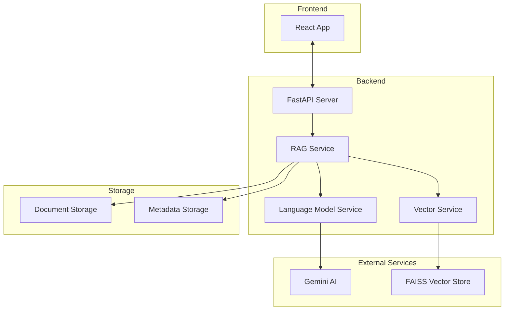
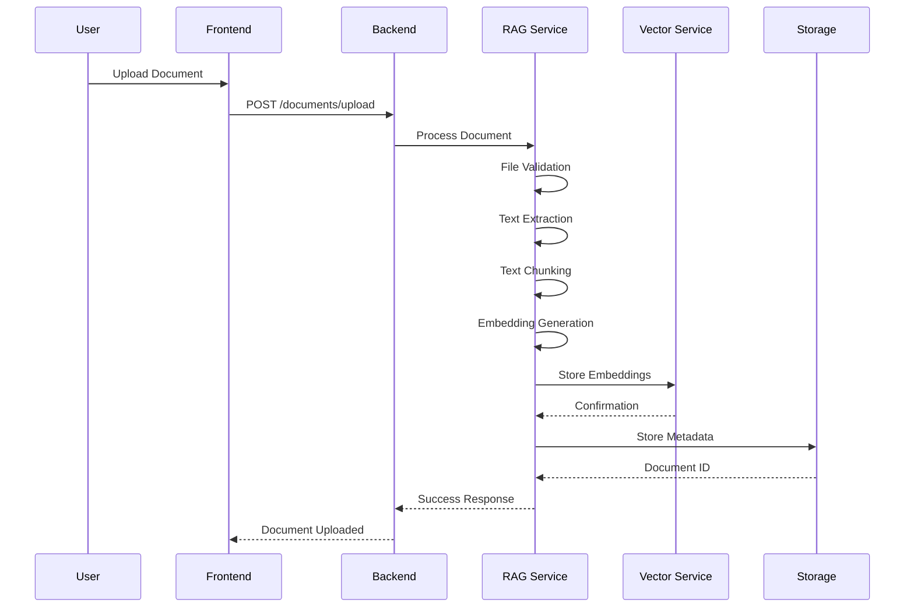
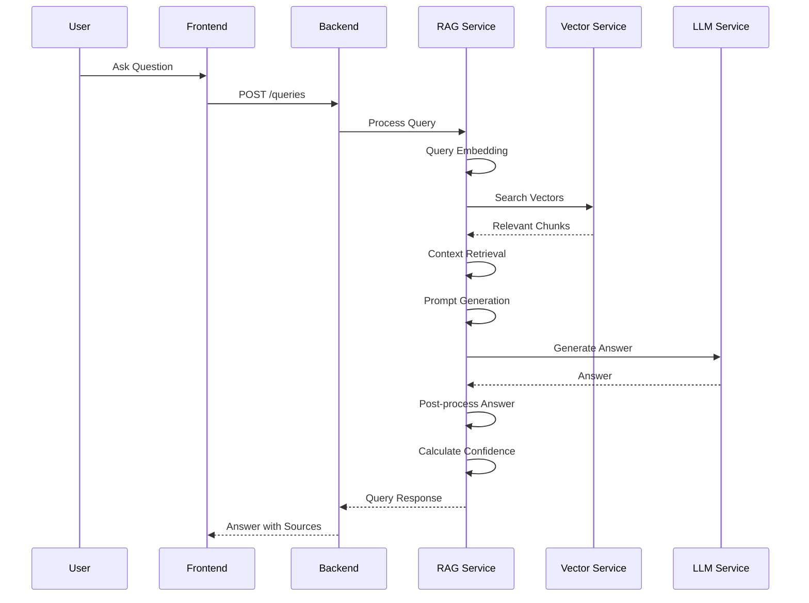

# DocuMind Backend - RAG Document Assistant

A sophisticated Retrieval-Augmented Generation (RAG) system built with FastAPI that provides intelligent document analysis and question-answering capabilities.

## System Architecture



## Project Structure

```
rag_sentence_transformers/
├── app/
│   ├── __init__.py
│   ├── config.py                 # Configuration settings
│   ├── main.py                   # FastAPI application entry point
│   ├── core/
│   │   ├── dependencies.py       # Dependency injection
│   │   └── exceptions.py         # Custom exceptions
│   ├── models/
│   │   ├── document.py           # Document data models
│   │   └── query.py              # Query request/response models
│   ├── routes/
│   │   ├── documents.py          # Document upload/management endpoints
│   │   ├── queries.py            # Query processing endpoints
│   │   └── health.py             # Health check endpoints
│   ├── services/
│   │   ├── document_service.py   # Document processing logic
│   │   ├── embedding_service.py  # Text embedding generation
│   │   ├── language_model_service.py # LLM integration (Gemini/Mock)
│   │   ├── prompt_service.py     # Prompt engineering and templates
│   │   ├── rag_service.py        # Main RAG orchestration
│   │   └── vector_service.py     # Vector store operations
│   └── utils/
│       ├── file_handler.py       # File processing utilities
│       ├── logger.py             # Logging configuration
│       └── text_processor.py     # Text preprocessing
├── data/                         # Document storage
├── logs/                         # Application logs
├── config.env                    # Environment configuration
├── requirements.txt              # Python dependencies
└── run.py                        # Application runner
```

## How It Works

### 1. Document Processing Pipeline



**Step-by-step process:**

1. **Document Upload**: Accepts PDF, DOCX, and TXT files
2. **File Validation**: Checks file size, format, and security
3. **Text Extraction**: Extracts raw text from documents
4. **Text Chunking**: Splits text into overlapping chunks (1000 chars, 200 overlap)
5. **Embedding Generation**: Converts chunks to vector embeddings using sentence-transformers
6. **Vector Storage**: Stores embeddings in FAISS index for fast similarity search
7. **Metadata Storage**: Stores document metadata and chunk information

### 2. Query Processing Pipeline



**Step-by-step process:**

1. **User Query**: Receives natural language question
2. **Query Embedding**: Converts question to vector embedding
3. **Vector Search**: Finds most similar document chunks using FAISS
4. **Context Retrieval**: Retrieves top-k relevant chunks with metadata
5. **Prompt Generation**: Creates structured prompt with context and question
6. **LLM Processing**: Sends to language model (Gemini AI or fallback)
7. **Answer Generation**: Generates coherent answer based on context
8. **Response Formatting**: Returns structured response with sources and confidence

## Core Components

### 1. RAG Service (`rag_service.py`)

The central orchestrator that coordinates the entire RAG pipeline.

**Key Features:**
- **Intelligent Context Retrieval**: Retrieves 2x more chunks than requested for better coverage
- **Context Enrichment**: Deduplicates and formats context chunks
- **Confidence Calculation**: Multi-factor confidence scoring
- **Answer Post-processing**: Cleans and formats responses

```python
class RAGService:
    def process_query(self, query_request: QueryRequest) -> QueryResponse:
        # 1. Generate query embedding
        # 2. Retrieve relevant context
        # 3. Enrich and format context
        # 4. Generate prompt
        # 5. Process with LLM
        # 6. Post-process answer
        # 7. Calculate confidence
        # 8. Return structured response
```

### 2. Language Model Service (`language_model_service.py`)

Multi-provider LLM integration with fallback mechanisms.

**Supported Providers:**
- **Gemini AI**: Google's advanced language model (primary)
- **Mock Service**: Intelligent fallback with context-aware responses
- **OpenAI**: GPT models (configurable)
- **Hugging Face**: Local transformer models

**Key Features:**
- **Graceful Rate Limiting**: Falls back to mock service when rate limited
- **Context-Aware Responses**: Different response types based on question keywords
- **Enhanced Parameters**: Optimized settings for document analysis

### 3. Prompt Service (`prompt_service.py`)

Advanced prompt engineering with multiple specialized templates.

**Prompt Types:**
- **General QA**: Standard question-answering
- **Summarization**: Document and section summaries
- **Analytical**: Deep analysis and interpretation
- **Comparison**: Similarity and differen
