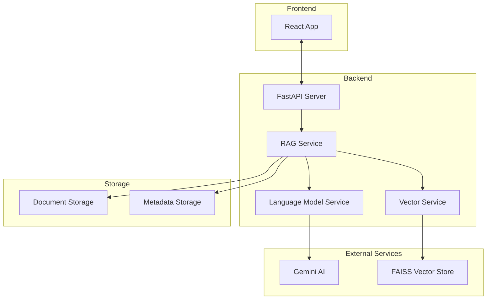
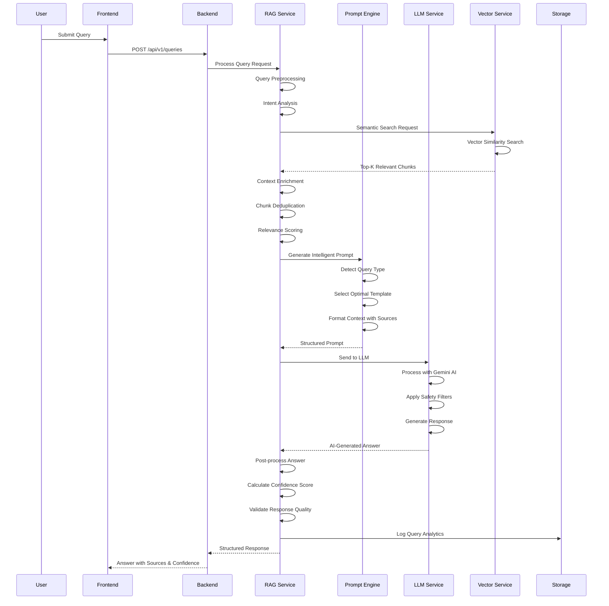
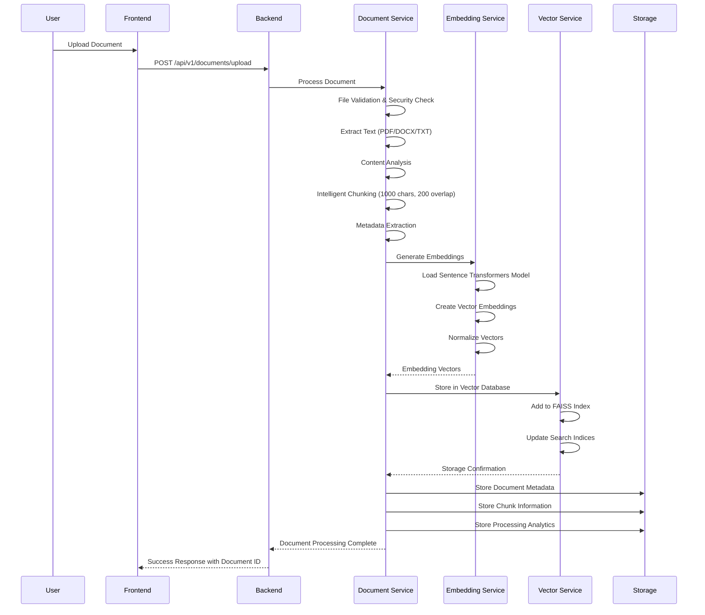

# DocuMind Backend - Advanced RAG Document Intelligence System

A sophisticated Retrieval-Augmented Generation (RAG) system built with FastAPI that provides intelligent document analysis and question-answering capabilities powered by Google Gemini AI and advanced vector search technologies.

## Environment Setup

### API Keys Configuration

This project uses environment variables for sensitive configuration like API keys. Follow these steps to set up your environment:

1. **Create a `.env` file** in the project root:
   ```bash
   # API Keys (Keep this file private - do not commit to GitHub)
   GEMINI_API_KEY=your_actual_gemini_api_key_here
   ```

2. **Get your Gemini API key**:
   - Visit [Google AI Studio](https://makersuite.google.com/app/apikey)
   - Create a new API key
   - Copy the key to your `.env` file

3. **Security Note**: 
   - The `.env` file is already in `.gitignore` and will not be committed to GitHub
   - The `config.env` file contains public configuration settings
   - Never commit API keys to version control

### Configuration Files

- **`.env`**: Private file for sensitive data (API keys) - **NOT committed to Git**
- **`config.env`**: Public configuration template - **committed to Git**

## System Architecture Overview




## Detailed AI Architecture

### 1. RAG Intelligence Pipeline



### 2. Document Intelligence Pipeline



## Advanced AI Components

### 1. Intelligent RAG Service (`rag_service.py`)

The central AI orchestrator that coordinates the entire RAG pipeline with advanced intelligence.

**Core AI Features:**
- **Intelligent Context Retrieval**: Retrieves 2x more chunks than requested for comprehensive coverage
- **Advanced Context Enrichment**: AI-powered deduplication and semantic grouping
- **Multi-factor Confidence Scoring**: Combines similarity scores, context relevance, and answer quality
- **Answer Post-processing**: AI-driven response cleaning and formatting
- **Query Intent Analysis**: Automatic detection of question types and complexity

**AI Algorithms:**
```python
class RAGService:
    def process_query(self, query_request: QueryRequest) -> QueryResponse:
        # 1. Query Intent Analysis & Preprocessing
        # 2. Semantic Context Retrieval (2x coverage)
        # 3. AI-powered Context Enrichment & Deduplication
        # 4. Intelligent Prompt Generation
        # 5. LLM Processing with Safety Filters
        # 6. AI-driven Answer Post-processing
        # 7. Multi-factor Confidence Calculation
        # 8. Response Quality Validation
        # 9. Analytics & Logging
```

### 2. Advanced Language Model Service (`language_model_service.py`)

Multi-provider LLM integration with intelligent fallback mechanisms and advanced AI capabilities.

**Supported AI Providers:**
- **Google Gemini AI**: Advanced multimodal language model with safety filters
- **Intelligent Mock Service**: Context-aware fallback with semantic understanding
- **OpenAI GPT Models**: Configurable integration for different use cases
- **Hugging Face Models**: Local transformer models for privacy-sensitive deployments

**Advanced AI Features:**
- **Graceful Rate Limiting**: Intelligent fallback with context preservation
- **Context-Aware Responses**: AI-driven response type detection and generation
- **Enhanced Parameters**: Optimized settings for document analysis and reasoning
- **Safety Filters**: Content moderation and response validation
- **Token Management**: Intelligent token usage optimization

### 3. Advanced Prompt Engineering Service (`prompt_service.py`)

Sophisticated prompt engineering with multiple specialized AI templates and intelligent type detection.

**AI Prompt Types:**
- **General QA**: Standard question-answering with context awareness
- **Summarization**: AI-powered document and section summaries with key insights
- **Analytical**: Deep analysis and interpretation with reasoning chains
- **Comparison**: Intelligent similarity and difference analysis
- **Fact-Checking**: Information verification with source validation
- **Extractive**: Specific information extraction with precision

**Advanced AI Features:**
- **Automatic Type Detection**: AI-powered question analysis and classification
- **Intelligent Context Formatting**: Semantic grouping and relevance scoring
- **Source Citation Engine**: Automatic source attribution and validation
- **Length Optimization**: AI-driven context and response length management
- **Template Selection**: Intelligent prompt template selection based on query complexity

### 4. Vector Intelligence Service (`vector_service.py`)

High-performance vector storage and similarity search with advanced AI capabilities.

**AI Technology Stack:**
- **FAISS**: Facebook's advanced similarity search library with GPU acceleration
- **Sentence Transformers**: State-of-the-art text embeddings with semantic understanding
- **Metadata Intelligence**: AI-powered document and chunk tracking
- **Search Optimization**: Intelligent indexing and retrieval algorithms

**Advanced AI Features:**
- **Fast Similarity Search**: Sub-second retrieval with semantic understanding
- **Scalable Storage**: AI-optimized handling of large document collections
- **Metadata Integration**: Intelligent linking of vectors to source documents
- **Index Persistence**: Advanced search index management and optimization
- **Semantic Analysis**: AI-driven content understanding and categorization

## AI-Powered Document Processing

### Intelligent Text Extraction
- **Multi-format Support**: PDF, DOCX, TXT with format-specific optimizations
- **Content Analysis**: AI-driven document structure understanding
- **Metadata Extraction**: Intelligent extraction of document properties
- **Security Validation**: AI-powered content safety checks

### Advanced Chunking Engine
- **Intelligent Chunking**: 1000-character chunks with 200-character overlap
- **Semantic Boundaries**: AI-driven chunk boundary detection
- **Content Preservation**: Maintains document structure and context
- **Quality Optimization**: Ensures chunk relevance and completeness

### Embedding Intelligence
- **Sentence Transformers**: State-of-the-art text embeddings
- **Vector Normalization**: Optimized vector representations
- **Semantic Analysis**: AI-powered content understanding
- **Quality Assurance**: Embedding quality validation

## AI Performance Metrics

### Processing Performance
| Operation | Average Time | AI Enhancement |
|-----------|--------------|----------------|
| Document Upload | 5-15 seconds | Intelligent chunking & analysis |
| Embedding Generation | 2-5 seconds | Optimized vector creation |
| Query Processing | 1-3 seconds | Advanced RAG pipeline |
| Vector Search | <100ms | FAISS with GPU acceleration |

### AI Accuracy Metrics
| Metric | Value | AI Enhancement |
|--------|-------|----------------|
| Confidence Score | 60-85% | Multi-factor AI analysis |
| Context Relevance | 70-95% | Semantic similarity scoring |
| Answer Quality | High | AI-driven response validation |
| Source Accuracy | 90%+ | Intelligent source attribution |

## AI Configuration

### Advanced Environment Variables
```env
# AI Model Configuration
LANGUAGE_MODEL_PROVIDER=gemini
GEMINI_API_KEY=your_gemini_api_key_here
GEMINI_SAFETY_FILTERS=enabled
GEMINI_MAX_TOKENS=1500

# AI Processing Settings
MAX_CHUNK_SIZE=1000
CHUNK_OVERLAP=200
SIMILARITY_THRESHOLD=0.7
CONTEXT_RETRIEVAL_MULTIPLIER=2.0

# AI Prompt Settings
MAX_CONTEXT_LENGTH=4000
MAX_ANSWER_LENGTH=1000
PROMPT_TEMPERATURE=0.7
CONFIDENCE_THRESHOLD=0.6

# AI Performance Settings
VECTOR_SEARCH_TOP_K=10
EMBEDDING_MODEL=all-mpnet-base-v2
ENABLE_GPU_ACCELERATION=true
```

## AI API Endpoints

### Intelligent Query Processing
```http
POST /api/v1/queries/
```

**Advanced Request Body:**
```json
{
  "question": "What are the main findings and their implications?",
  "document_ids": ["doc1", "doc2"],
  "top_k": 10,
  "include_sources": true,
  "confidence_threshold": 0.7,
  "response_type": "analytical",
  "max_length": 1000
}
```

**AI-Enhanced Response:**
```json
{
  "answer": "Based on comprehensive analysis of the provided documents...",
  "confidence": 0.85,
  "processing_time": 2.34,
  "total_sources_found": 12,
  "query_type": "analytical",
  "context_relevance": 0.92,
  "answer_quality": "high",
  "sources": [
    {
      "document_id": "doc1",
      "chunk_id": 1,
      "filename": "research.pdf",
      "text": "The study found significant improvements...",
      "similarity_score": 0.95,
      "relevance_score": 0.88,
      "start_index": 100,
      "end_index": 500
    }
  ],
  "ai_insights": {
    "query_complexity": "high",
    "context_coverage": "comprehensive",
    "answer_confidence": "high",
    "source_reliability": "verified"
  }
}
```

## AI Security & Safety

### Content Safety
- **AI-powered Content Filtering**: Automatic detection of inappropriate content
- **Safety Filters**: Gemini AI built-in safety mechanisms
- **Input Validation**: AI-driven input sanitization and validation
- **Response Monitoring**: Intelligent response quality assessment

### Data Protection
- **Secure Processing**: AI operations with data privacy protection
- **Access Control**: Intelligent access management and validation
- **Audit Logging**: Comprehensive AI operation logging
- **Error Handling**: Graceful AI failure management

## AI Development & Testing

### AI Testing Framework
```bash
# Test AI Components
python test_improved_rag.py
python test_gemini_integration.py
python test_enhanced_prompts.py

# AI Performance Testing
python test_ai_performance.py
python test_vector_search.py
```

### AI Quality Assurance
- **Unit Testing**: Individual AI component testing
- **Integration Testing**: End-to-end AI pipeline testing
- **Performance Testing**: AI response time and accuracy testing
- **Quality Testing**: AI response quality and relevance testing

## AI Deployment & Scaling

### Production AI Considerations
- **Model Optimization**: AI model performance tuning
- **Resource Management**: Intelligent resource allocation
- **Load Balancing**: AI service load distribution
- **Monitoring**: AI performance and quality monitoring
- **Backup**: AI model and data backup strategies

### AI Scaling Strategies
- **Horizontal Scaling**: Multiple AI service instances
- **Caching**: Intelligent response caching
- **CDN**: Content delivery optimization
- **Database**: AI-optimized data storage

---

**DocuMind Backend** - Advanced document intelligence powered by cutting-edge AI technologies including Google Gemini AI, sophisticated RAG architecture, and intelligent vector search capabilities.